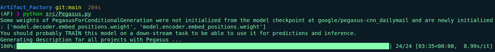
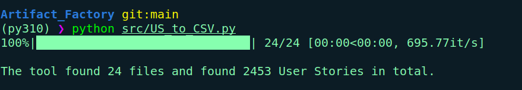
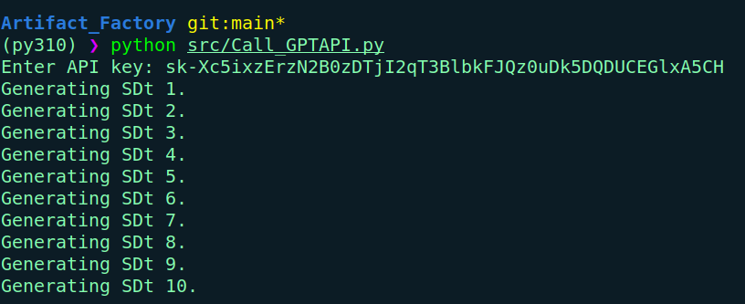
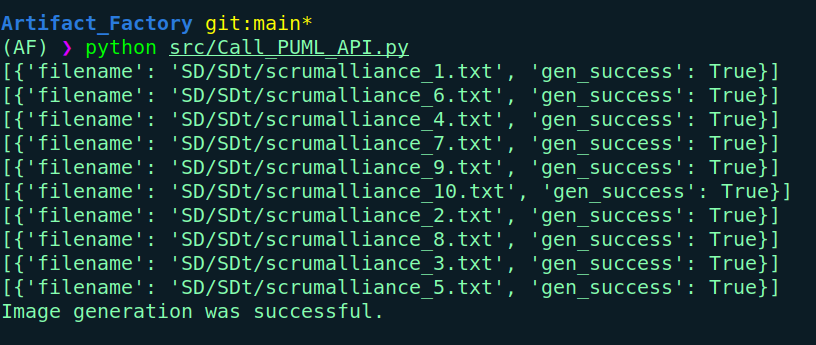

# Artifact_Factory

This tool is an automated benchmark creator for creating requirement related Software Artifact benchmarks. This tool prompts LLMs (ChatGPT, Gemini) to generate artifacts such as Sequence Diagrams.

## To Do:

1. ### Find a better prompt!!!

   1. Experiment:
      1. 100 Random USs
      2. Prj desc + USs
      3. Prj desc + USs + 3 USs from multiple prompts same prj
      4. for 3 Directional Stimulus Prompting (DSP)

   ### Goal: prove the best way to get SDs

   ### Outcome: finding out the best prompt

   Based on the results create the benchmark

2. Change parameters for BART and Pegasus to get better summaries.
   
   
3. Add Draw.io API
4. Add `Gemini` script --> Gemini API key needed

## How to use:

1. For using this tool first clone the this repo with following command:

```
git clone https://github.com/RezaGolpayegani/Artifact_Factory.git
```

1. Go to the folder:

```
cd Artifact_Factory
```

1. Install the requirements:

```
pip install -r requirements
```

1. Now you should put your user stories in text files and put those text files in `data/All_US` folder, you must put the user stories which relate to same project in the same text file.

2. Run `src/US_to_CSV.py` finds all of the text files in `data/All_US` and creates `data/All_US.csv`. The first column of this csv file is the file number which referes number of the files that the script finds, second column is text file name, third column is line number in the corresponding text file, fourth column is project name which is extracted from text file names, and the content of the fifth column is user stories. You can run this script with the following command:

```
python src/US_to_CSV.py
```



1. Run `src/Call_GPTAPI.py` this script reads User Stories from the csv file which is created in the previous step and prompts them to ChatGPT 4 you can change the engine model in the script. The outputs of this script are the textual sequence diagram which are stored in `SD/SDT` folder and full answer of ChatGPT which is stored in `SD/Full_A_GPT`. You can run this script with the following command:

```
python src/Call_GPTAPI.py

```



7. Run `src/Call_PUML_API.py` this script sends the textual sequence diagrams to PlantUML Web Server [PlantUML Web Server](https://plantuml.com/sequence-diagram) using its API. The output of this script is visualized sequence diagrams in ".png" format which are stored in `SD/SDi` folder. You can run this script with the following command:

```
python src/Call_PUML_API.py

```



## Acknowledgment

This research is supported by multiple sources, including the Natural Sciences and Engineering Research Council of Canada (NSERC) Discovery Grants program and the industry-stream NSERC CREATE in Software Analytics Research (SOAR). Additionally, support comes from two Canada First Research Excellence Funds (CFREFs) grants managed by the Global Institute for Food Security (GIFS) and the Global Institute for Water Security (GIWS). Acknowledgements are extended to Prof. Chanchal K. Roy, the Director of SOAR, for his invaluable guidance and assistance throughout the industry-stream SOAR program. Prof. Roy's efforts in organizing various lectures, professional development workshops, talks, Industry and Mitacs workshops, graduate professional skills development programs, entrepreneurship training, and industrial internships have greatly contributed to the author's preparedness to meet the evolving demands of the job market.
